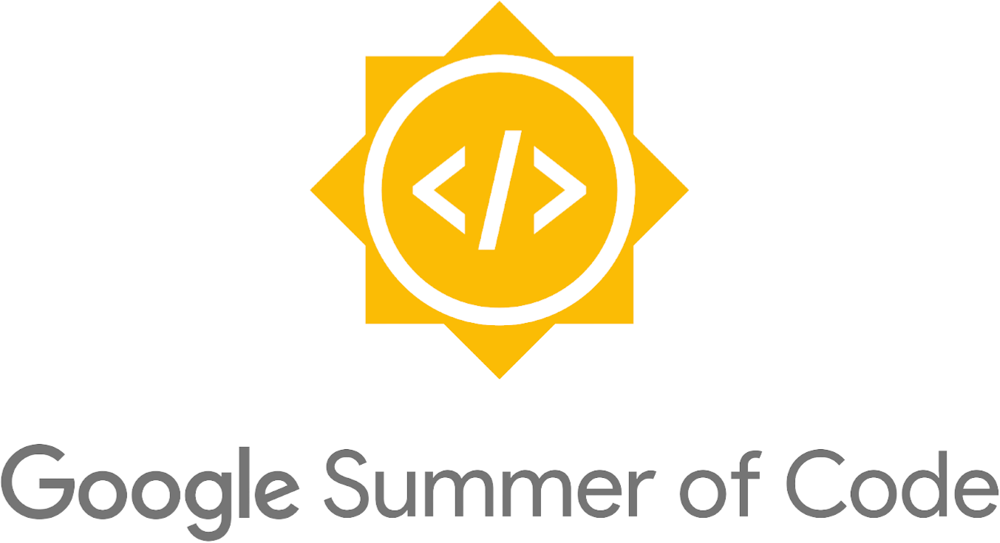

# GSoC Project 2021 - TensorFlow

  

## Description
This repository contains the project where I contributed to the TensorFlow Team during GSoC in the year 2021.

## Details

* **Year**: 2021
* **Organisation**: [TensorFlow](https://www.tensorflow.org/)
* **Project Title**: Improve Computer Vision Samples Apps
* **Project Description**: The idea behind the project is to improve the sample apps of Computer Vision which uses TensorFlow Lite Task Library as well as TensorFlow Support Library. The main objective is to implement CameraX and update the app so that the developers from the community find it easy to integrate Machine Learning with Android Apps.
* **Mentors**: [George Soloupis](https://www.linkedin.com/in/george-soloupis/) and [Margaret M.](https://www.linkedin.com/in/margaretmz/)

## 🖥 Tasks
| Sl No | Task                                                                                         | Status  |
|-------|----------------------------------------------------------------------------------------------|---------|
| 1     | **Implement CameraX and remove the usage of fragments with the existing Camera2 and Camera API** |   Done  |
| 2     | **Implement Support Library with TensorFlow Lite Interpreter**                                  |   Done  |
| 3     | **Implement Data Binding**                                                                      |   Done  |
| 4     | **Implement the Image to BitMap conversion and modify Support Library and Task Library**         |   Done  |
| 5     | **Modify the Test Code in Android**                                                             |   Done  |
| 6     | **Add a Bounding Box Function in tflite-support library** (Stretch Goal)                         | Ongoing |

> You can find my Pull Request [here](https://github.com/tensorflow/examples/pull/341). 

> Blog Link: Coming Soon

## Acknowledgements

I want to thank [George Soloupis](https://www.linkedin.com/in/george-soloupis/), [Margaret M.](https://www.linkedin.com/in/margaretmz/), [Meghna Natraj](https://www.linkedin.com/in/meghnanatraj/), [Lu Wang](https://www.linkedin.com/in/lu-wang-21619a31/) and [TensorFlow Team](https://www.tensorflow.org/). I would also like to thank [Le Viet Gia Khanh](https://www.linkedin.com/in/lvgk/) and [Tian Tian](https://www.linkedin.com/in/tian-tian-01767a17/) for reviewing my pull request.  

## License

[MIT](https://github.com/sayannath/GSoC-Project-2021/blob/main/LICENSE)
  
## 🔗 Links

